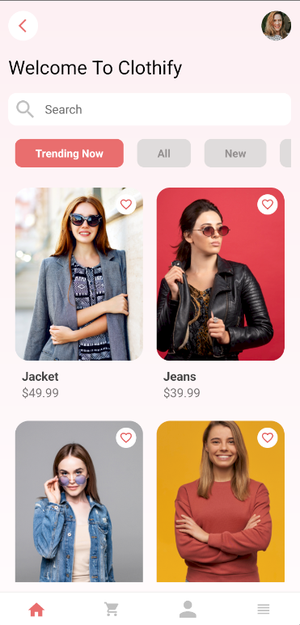
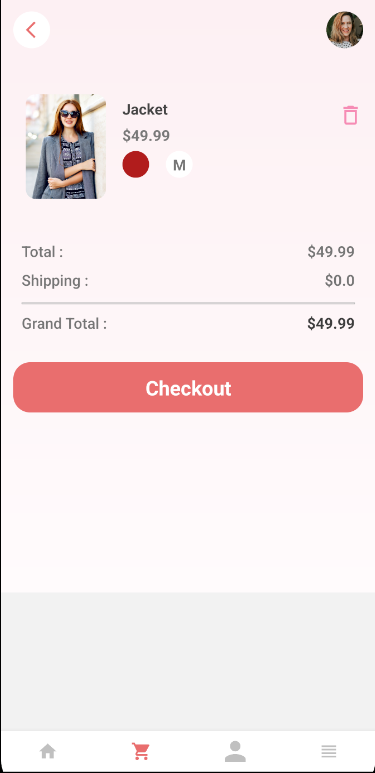
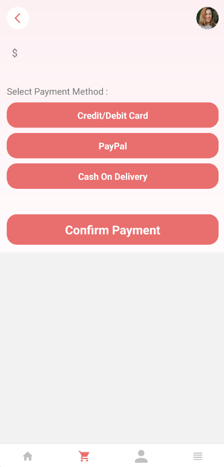
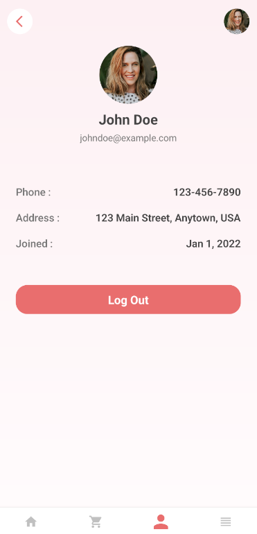
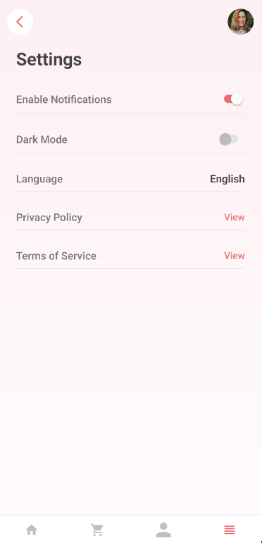

# Clothify

Welcome to **Clothify**, A Modern And User-Friendly Clothing Store App Built With React Native !  
**Clothify** Allows Users To Browse And Shop For Stylish Clothing With Ease, Ensuring A Seamless And Delightful Shopping Experience.

## Features :

- **Browse Products**: View The Latest Fashion Trends And Styles.  
- **Search Functionality**: Easily Find Specific Items Using The Search Bar.  
- **Product Details**: View Detailed Descriptions, Sizes, And Prices Of Clothing Items.  
- **Cart Management**: Add, Remove, Or Modify Items In Your Shopping Cart.  
- **Secure Checkout**: Complete Your Purchases With Secure Payment Options.  
- **User Profile**: Manage Account Details, View Order History, And More.

## Screenshots :

Below Are The Screenshots Of Each Page In The App :

### 1. **Home Page**  
*Description*: Browse Featured Items, New Arrivals, And More.  
 

### 2. **Product Listing Page**  
*Description*: Explore The Clothing Categories With A Clean Layout.  
 

### 3. **Cart Page**  
*Description*: Review And Modify Items Before Checkout.  
 

### 4. **Checkout Page**  
*Description*: Enter Your Payment Details And Shipping Information.  
 

### 5. **Profile Page**  
*Description*: Update User Information And View Order History.  
 

### 6. **Settings Page**  
*Description*: For Customisation Of The App.  
 

### 7. **Login Page**  
*Description*: Simple Login Page.  
 

### 8. **Sign-Up Page**  
*Description*: For Registering In App.
 

### 9. **Forget Password Page**  
*Description*: Update User Information And View Order History.
 

---

## How To Run The App :

Follow These Steps To Get The App Running Locally:

### Pre-Requisites :

1. **Java 17**: Ensure That Java 17 Is Installed On Your System.  
2. **Node.JS And NPM**: Install Node.JS (Comes With NPM) From [Node.js official site](https://nodejs.org/).  
3. **React Native Environment**: Set up React Native CLI Or Expo environment As Per The [React Native docs](https://reactnative.dev/docs/environment-setup).

### Installation :

1. Clone This Repository.
2. In Root Folder, Run " npm install ".
3. Then Run " npm start start ".

---

### Thank You So Much.
